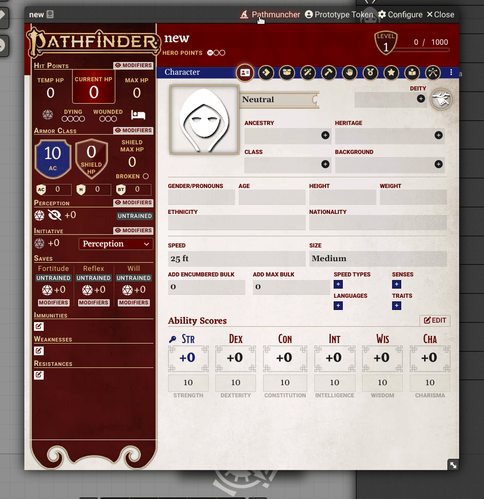

# Pathmuncher

&query=assets%5B1%5D.download_count&url=https%3A%2F%2Fapi.github.com%2Frepos%2FMrPrimate%2Fpathmuncher%2Freleases%2Flatest)

Import characters from Pathbuilder to Foundry Pathfinder 2e.

## How To

1. Build your character in [Pathbuilder(https://pathbuilder2e.com/)].
2. Export your character using "Export JSON" from Pathbuilder via the burger menu
3. Click the Pathmuncher icon in the characters title bar.
4. Enter the 6 digit user ID number from the pathbuilder in the bottom section
5. Import the character.

## About

This is inspired by the previous [pathbuilder2e-import](https://github.com/kobseryqum/foundry-pathbuilder2e-import) package, but is written afresh from the ground up, capturing some of my experience from [DDB Importer](https://github.com/MrPrimate/ddb-importer).

To use this module the users must have the CREATE ACTOR ability, as it creates temporary actors as part of the import process.

## Known Issues

- There are differences between Pathbuilder names and Foundry names. If you find any, please open an issue, or drop a note in Discord with as much detail as possible, ideally with a shared link to a pathbuilder character.
- Support for "dual classed" characters from the Advanced Players guide is ropey at best, and not supported in Remastered system.

## Bugs and Issues

Please open bugs and issues on [github](https://github.com/MrPrimate/pathmuncher/issues/new/choose), or via the Discord channel [#pathmuncher](https://discord.gg/M6jvpfreNd).
